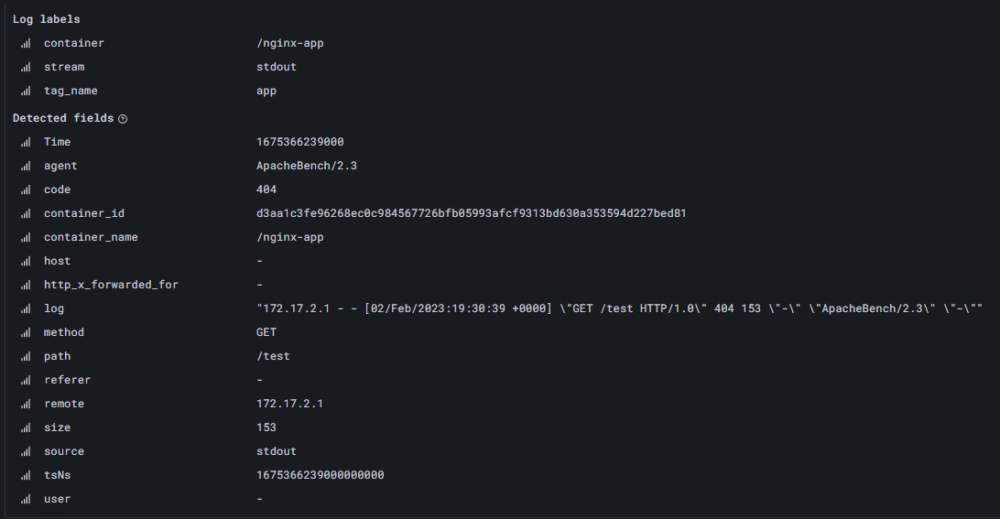
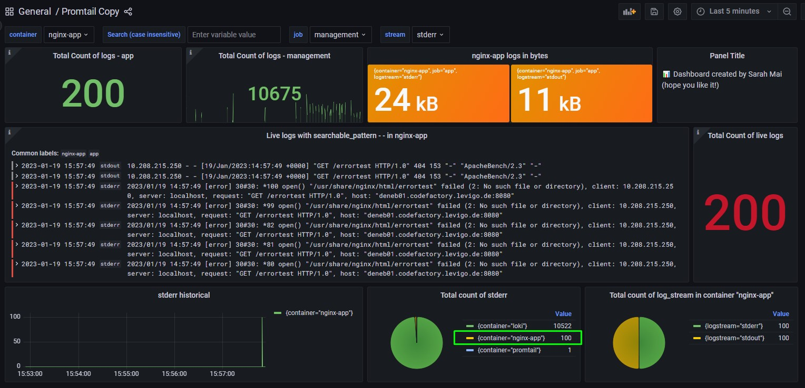

# Philosophy

This repository is intended to give a first insight into the functionality of the Elastic Stack as well as Grafana Loki
with the two different log collectors Promtail and Fluentd. Kibana and Grafana will be used as visualization tools. The
log aggregators will be rolled out using Docker Compose.

The goal is to provide the easiest possible entry point for anyone who feels like experimenting with these technologies.
The default configuration is intentionally kept minimal. It relies on no external dependencies and uses as little custom
automation as necessary to make things work.

There is an emphasis on good documentation, so this repository serves as a template and can be modified by anyone.


## Requirements for the logging technology stack

From a developer's perspective, there are several requirements for a logging technology stack to ensure effective and
reliable logging. For the following test setup, which is intended to give a first insight into the functionality of the
Elastic Stack as well as Grafana Loki, the requirements are limited to:

* Free of charge: Free testing of the most important features is possible.
* User-friendly technology stack : The technology stack is easy to use and configure.
* Roll out with Docker Compose: A fast and easy roll out of services, on different systems, is possible.
* Completeness: all logs are completely collected and displayed.
* Query language is user-friendly: the Querry language is intuitive and easy to use.
* Intuitive: The visualization tool (Grafana, Kibana) is intuitive and easy to use.

Requirements such as scalability, reliability, performance, security and cost-effectiveness do not matter.

# Log-Aggregation

## What Is Log Aggregation

Log aggregation is the process of collecting log events from different sources in an IT infrastructure and standardizing
them to enable faster log analysis. By using log collectors, the collected logs are stored in a central location, which
is why the process is also called log centralization. There are a variety of log aggregators on the market. They vary,
of course, but are based on a similar architecture with logging clients and/or agents on each host that forward messages
to collectors, which in turn forward them to a central location.

## Log Aggregation Tools

* **Elastic Stack:**
  The Elastic Stack is one of the most well-known and widely used log aggregation tools. It is a set of monitoring tools
  and known as ELK or EFK Stack - Elasticsearch (object store), Logstash or FluentD (log routing and aggregation), and
  Kibana for visualization.

  Elasticsearch is a search engine built on Apache Lucene. Once the log data is collected, it is stored as unstructured
  JSON objects. Both the key of the JSON object and the contents of the key are indexed. Elasticsearch indexes all data
  in every field.


* **PLG Stack:**
  The PLG stack, which consists of Promtail, Loki, and Grafana, is mostly known as Grafana Loki. The Promtail agent is
  designed for Loki installations, but many other agents integrate seamlessly with Loki. For example, Fluentd and
  Logstash.

  Grafana Loki is a horizontally scalable, highly available, multi-tenant log aggregation system inspired by Prometheus.
  Unlike other logging systems, a Loki index is built from labels, leaving the original log message unindexed. Loki
  stores all data in a single object storage backend like S3. The Loki project was startedd at Grafana Labs in 2018 and
  is released under the AGPLv3 license. For more information about Loki, its components and functionality, please read
  the latest  [documentation][1] or my blog post ["Logging on a large scale with Grafana Loki"][2].

## How to aggregate logs

Log collectors run on servers, pull server metrics, analyze all logs, and then transmit them to systems like
Elasticsearch. It is their routing mechanism that ultimately enables log analysis. Some of the most popular log agents
are:

* [Promtail][4] Promtail acquires logs, turns the logs into streams, and pushes the streams to Loki through an HTTP API.
  It is usually deployed to every machine that has applications needed to be monitored. The Promtail agent is designed
  for Loki installations and therefore it is the default agent for Loki.

* [Fluentd:][5] Fluentd is a cross-platform open source data collection software originally developed at Treasure Data
  under the Apache 2 license. It is written primarily in the Ruby programming language. It has plugin-architecture and
  with more than 500 plugins, many developed by the community, Fluentd can connect to many data sources and outputs.
  Most of Fluentd's plugins are decentralized and are located in various Git repositories. A list of all plugins can be
  found on the [official Fluentd site][9]. Fluentd provides an in-built buffering system that can be configured based on
  the needs. It uses built-in parsers (JSON, Regex, CSV, etc.) for log parsing by default. Routing is based on tags.

_Hint_

Docker provides a built-in fluentd logging driver. The logging driver sends container logs as structured log data to the
fluentd collector.

## Data visualization tools

Grafana and Kibana are two open source data visualization tools used for monitoring, analyzing and visualizing large
data sets. Both tools are widely used in log management, metrics monitoring, and data analysis.

**Grafana** is an easy-to-use platform that provides users with the ability to visualize and analyze data from various
sources such as databases, APIs, and even IoT devices. It supports a wide range of data sources, including
Elasticsearch, Prometheus, InfluxDB, Graphite and more. Grafana has a user-friendly interface that allows users to
create and customize dashboards with different visualization types, such as graphs, charts and tables. It also has an
extensive library of plugins and extensions that allow users to extend its functionality.

**Kibana**, on the other hand, is a part of the Elasticsearch stack and is designed to work seamlessly with
Elasticsearch. It is a data exploration and visualization tool that allows users to search, analyze and visualize data
stored in Elasticsearch indexes. Kibana provides a web-based interface that allows users to create and customize
interactive visualizations and dashboards with real-time data. It supports a wide range of data types, including text,
numeric, geospatial and time series data.

## Query Languages

### [LogQL][14]

LogQL is the query language for Grafana Loki. It is inspired by PromQL (Prometheus query language) and uses log labels
for filtering and selecting the log data. There are two types of LogQL queries. **Log queries** return the contents of
log lines, whereas **metric queries** extend log queries to calculate values based on the query results.

A LogQL query consists of two parts: The Log Stream Selector and a search expression. A stream can be selected by
specifying one or more labels:

This sample query searches for logs where the value of the label 'container' matches the container name and also matches
the regular expression.


To search the stream for a certain string, a search expression can be used. This can be a simple match with `|=` or a
regular expression using `|~`. The whole thing can also be negated by using a `!` instead of the pipe. Here are a few
examples:

```yml
  { app="nginx" } |= "GET"
    { app="nginx" } |~ "200|201|202"
    { app="nginx" } != "GET"
    { app="nginx" } !~ "200|201|202"
```

#### Labels

Labels are key-value pairs and can be defined arbitrarily, including in the Scrape configuration. The combination of key
and value of each label defines a stream [see][15].

```yml
scrape_configs:
  - job_name: system
    pipeline_stages:
    static_configs:
      - targets:
          - localhost
        labels:
          job: syslog
          __path__: /var/log/syslog
```

The configuration `job=syslog` will tail one file and assign one label. It could be queried with `{job=”syslog”}`.

#### logfmt

The logfmt parser can be added using the `| logfmt` and will extract all keys and values from the logfmt formatted log
line. Keys from detected fields can then be used like labels. An example query of the sum of all http status codes of
the last minute could look like this.

```yml
sum by(code) (count_over_time({container="/nginx-app"} | logfmt | remote != ``[1m]))
```



#### Loki Pattern Parser

Since Loki v2.3.0 it is possible to dynamically create new labels at query time by using a pattern parser in the LogQL
query.

To split, for example, the contents of an Nginx log line into several components and use them as labels for further
queries, a pattern parser can be used. This way, the remote_addr, method, request, protocol, and status values among
many others can be extracted from the following example.

```yml
2023-01-31 13:43:56	stdout    172.17.2.1 - - [31/Jan/2023:12:43:56 +0000] "GET /test HTTP/1.0" 404 153 "-" "ApacheBench/2.3" "-"
```

```yml
{ job="nginx" } | pattern `<_> - - <_> "<method> <_> <_>" <status> <_> <_> "<_>" <_>`
```

The above query passes the pattern to the Nginx log stream results and adds two additional labels method and status (
This can be optionally extended). These labels can then be used to execute metric or filter queries.

In the dashboard [Promtail](Analyze the data that is available in the Loki data source) several queries can be found
where a pattern was used to determine the e.g. request method. More detailed documentation about the pattern parser can
be found at the following [link][16].

### Query DSL and Lucene query language

In Elasticsearch, the Query DSL (Domain-Specific Language) is used to formulate search queries. The Query DSL is a
JSON-based syntax that allows you to create and execute complex search queries. It also supports a full-text search.

The Query DSL provides a variety of search types and aggregations to satisfy a wide range of search requirements. It
also allows users to restrict search queries to specific fields, define filters, and combine complex search queries.

Example of Query DSL:

Suppose we have a Fluentd instance that collects logs from various applications and we want to retrieve all logs
originating from the infrastructure applications tagged `infra`. The query DSL search query that satisfies these
requirements may look like the following:

```json
{
  "query": {
    "bool": {
      "must": [
        {
          "match": {
            "tag": "myapp"
          }
        }
      ]
    }
  }
}
```

However, Elasticsearch also supports other search query languages such as Lucene query language and SQL. It is possible
to formulate search queries in these languages and send them to Elasticsearch, but Query DSL is the preferred search
query language recommended by Elasticsearch.

A search query in the Lucene query language that also searches for the tag `infra` might look like the following:

```makefile
tag:myapp
```

------------------------------------

# Installation & Configuration Tutorial

## Requirements

* [Docker Compose][18] version 1.25.5 or newer (including 3.8 compose version)
* [Docker Engine][19] version 19.03.0+ or newer ([including Compose file format 3.8][20])

## Grafana Loki


### Deployment modes

There are three different ways to roll out Loki. To learn more about the different modes, please read
the [official documentation][2].

* Monolithic mode
* Simple scalable deployment mode
* Microservices mode

In our use case, we run Loki as a monolith. This is the simplest mode of operation. Here, all microservice components of
Loki are run within a single process as a single binary or Docker image.

### Grafana Loki with Promtail (PGL)

* Before installing, make sure that the following ports are free: 49154 (for Loki), 3000 (for Grafana), 9080 (Promtail)
  and 8080 (nginx).

**Approach**

* Create docker container for Loki, Promtail and Grafana using Docker compose
* Create a config file for Promtail
* Setup Loki as data source in Grafana
* Analyze the data that available in the Loki data source

#### Docker-Compose File for PLG

The [docker-compose.yml](loki-promtail-example/docker-compose.yml) file defines the individual services (Loki, Promtail
and Grafana). This includes, for example, the image to be used, the ports to be exposed, and volumes needed to be
mounted. The Docker socket, which is needed to witness Docker events, is mounted in the Promtail service under volume.
Since we have a filter built into the Promtail config (see next section), which is configured to only collect containers
with the Docker label `logging=promtail` for logging and send them to Grafana Loki, this label must be defined in the
individual services. The label "job" can later be used to distinguish between "infra" and "app" applications.

```yml
    labels:
      logging: "promtail"
      job: "infra"
```

#### Config-files for Promtail

Before Promtail can send log data to Loki, it needs information about its environment and the existing applications
whose logs are to be transmitted. To do this, Promtail uses a mechanism from Prometheus called service discovery. Just
like Prometheus, Promtail is configured with a scrape_configs. Scrape_configs contains one or more entries that are
executed for each discovered target. In Promtail, there are several types of labels. For example, there
are `meta-labels`, but also `__path__` labels - which Promtail uses after detection to find out where the file to be
read is located.

The metadata (container_name, file name, etc.) determined during service detection, which can be appended to the log
line as a label for easier identification when querying logs in Loki, can be converted to a desired form using the
relabel_configs. For this purpose, each entry in the scrape_configs can also contain a relabel_configs. Relabel_configs
are a set of operations that can be used, for example, to change a label to a different target name. They allow
fine-grained control over what to include and what to discard, as well as over the final metadata to append to the log
line (see official [documentation][11]).

In our promtail configuration [promtail-config.yaml](loki-promtail-example/promtail/config/promtail-config.yaml), the
container logs are collected through the Docker socket and then filtered so that only Docker containers with the Docker
labels `logging=promtail` are collected. Once the logs are collected, the existing meta labels are transformed using
relabel_config. This gives us the container name as well as logstream and logging job.

```yml
scrape_configs:
  - job_name: container_scrape
    docker_sd_configs:
      - host: unix:///var/run/docker.sock
        refresh_interval: 5s
        filters:
          - name: label
            values: [ "logging=promtail" ]
    relabel_configs:
      - source_labels: [ '__meta_docker_container_name' ]
        regex: '/(.*)'
        target_label: 'container'
      - source_labels: [ '__meta_docker_container_log_stream' ]
        target_label: 'logstream'
      - source_labels: [ '__meta_docker_container_label_job' ]
        target_label: 'job'
```

To allow more sophisticated filtering afterwards, Promtail allows labels to be set not only from service discovery, but
also based on the content of individual log lines. The pipeline_stages can be used to add or update labels, correct the
timestamp or completely rewrite log lines. A pipeline is comprised of a set of 4 stages (see
official [documentation][12]).

* Parsing stages (Parse the current log line and extract data out of it.)
* Transform stages (Transform extracted data from previous stages)
* Action stages (Take extracted data from previous stages and do something with them)
* Filtering stages (optionally apply a subset of stages or drop entries based on some condition)

#### Setup Loki as data source in Grafana

So that we do not have to manually configure Loki in Grafana later, we can give the Grafana service
a [datasource configuration](./loki-promtail-example/grafana/provisioning/datasources/loki.yml). When starting the
service, Grafana automatically connects to Loki.

```yml
apiVersion: 1

datasources:
  - name: Loki
    type: loki
    url: http://loki:3100
    isDefault: true
```

#### Analyze the data that is available in the Loki data source

Once you have everything prepared, you can start the services.

``docker-compose up -d``

Then navigate to grafana at ``http://localhost:3000`` and select "explore" on the left. Select Loki as the database and
select the container you are interested in. Run the query and you will see the logs at the bottom.


The data can also be viewed in the dashboard provided. The configuration as well as the dashboard for this can be found
in the folder [Dashboards](./loki-promtail-example/grafana/provisioning/dashboards/). To display the dashboard in
Grafana, open the Dashboards tab on the left and select the "Promtail" dashboard.

#### Read in data from a test app

In the app-promtail folder you will find another [Docker-compose](loki-promtail-example/app/nginx-example.yaml) file.
This creates an nginx app. As with the infrastructure services (Grafana and Loki), the Promtail labels are assigned here
as well. Since this is an application outside the infrastructure level, we enter "App" for the job. This helps us to
distinguish the applications later.

````yml
services:
  nginx-app:
    container_name: nginx-app
    image: nginx
    labels:
      logging: "promtail"
      job: "app"
    ports:
      - 8080:80
````

Start with:
``docker-compose -f nginx-example.yaml up -d``

The Apache HTTP server benchmarking tool "[ApacheBench][13]" can be used to generate an arbitrary number of queries.

ApacheBench is a command line tool included in the apache2-utils package. In addition to the number of queries to send,
a timeout limit can be configured for the query header. ab sends the queries, waits for a response (until a
user-specified timeout), and prints statistics as a report.

The following command, should generate 100 logs in the nginx-app container in the stderr stream.

````ab -n 100 -c 100 http://{Server}:8080/errortest````


After the command is executed, 100 entries are visible in the stderr stream in the dashboard.

### Grafana Loki with Fluentd (FGL)

* Before installing, make sure that the following ports are free: 49154 (for Loki), 3000 (for Grafana), 24224 (for
  Fluentd) and 8080 (nginx).

**Approach**

* Create docker container for Loki, Fluentd and Grafana using Docker compose
* Create a config file for Fluentd
* Setup Loki as data source in Grafana
* Analyze the data that available in the Loki data source

#### Docker-Compose File for FLG

The [docker-compose.yml](loki-fluent-example/docker-compose.yml) file defines the individual services (Loki, Fluentd and
Grafana). This includes, for example, the image to be used, the ports to be exposed, and volumes needed to be mounted.
Unlike the configuration with Promtail, we do not connect the Docker socket to the Fluent container to access the logs
of each container. On the other hand, we provide a logging driver for each container to send logs to Fluent.

The Fluentd logging driver sends the container logs as structured log data to the Fluentd collector. In addition to the
actual log message, metadata such as ``container_id``, ``container_name``, and ``source`` are also sent in the
structured log message.

The following example sets the log driver to fluentd and sets the fluentd-address and tag option.

By default, Docker uses the first 12 characters of the container ID to tag protocol messages. By setting the tag option,
this id is overwritten with the string used.

More information about the available logging drivers can be found in the official [documentation][17].

```yml
    logging:
      driver: fluentd
      options:
        fluentd-address: localhost:24224
        tag: infra
```

#### Prepare configuration file for Fluentd in the FLG-Stack

The configuration file for Fluentd allows to control the input and output behavior by selecting input and output plugins
and setting plugin parameters. The file is required for Fluentd to operate properly.

It consists of seven directives, not all of which must always be present in a configuration file. For example, in our
example we use four of the seven directives:

* `source` determine the input sources
* `match`  determine the output destinations
* `filter` determine the event processing pipelines
* `label` group the output and filter for internal routing

The ``source`` plugin defines where all data comes from. Fluentd's default input plugins include http and forward. Http
provides an HTTP endpoint, while forward provides a TCP endpoint. With the container driver used, the TCP endpoint is
required. This is set on port 24224, which is also exposed in the docker-compose configuration.

```xml

<source>
    @type forward
    bind 0.0.0.0
    port 24224
</source>
```

As previously described in the section [Docker-Compose File for Fluentd](#docker-compose-file-for-fluentd), the docker
driver sends metadata such as the container name to Fluent in addition to the logs. This value can be taken from the
record using a ``Filters`` directive and the Fluentd default plugin ``record_transformer`` and stored as a local
variable. In this example the three variables ``tag_name``, ``container`` and ``stream`` are created. In the match
directive they can be accessed when setting the label.

```xml

<filter **>
        @type record_transformer
<record>
tag_name ${tag}
container ${record["container_name"]}
stream ${record["source"]}
</record>
        </filter>
```

The ``match`` plugin tells fluentd what to do with the data. The match directive looks for logs with matching tags and
processes them. Since the most common use of the match directive is to forward logs to other systems, plugins that match
the match directive are called output plugins.

Grafana Loki has a Fluentd output plugin called fluent-plugin-grafana-loki that allows logs to be sent to a private Loki
instance or Grafana Cloud. To use this plugin, it must be [installed][22] in the container. In this example, however,
this step is skipped. A [preconfigured container image][23] from Grafana is used.

Each match directive must contain a match pattern and a @type parameter. The @type parameter specifies the output plugin
to use. In the present Fluentd configuration, we use @type loki. Only events with a tag that matches the pattern are
sent to the output destination. In this example, a wildcard pattern is used. Any events that have not yet been processed
are sent to loki.

```xml

<match **>
        @type loki
        url "http://loki:3100"
        flush_interval 1s
        flush_at_shutdown true
        buffer_chunk_limit 1m
<label>
tag_name
container
stream
</label>
        </match>
```

``** matches zero or more tag parts - a.** matches a, a.b and a.b.c``

In order to be able to search and filter for logs later in Grafana, labels can be added.

This is possible by using either ``<label>...</label>`` or ``extra_labels`` to set at least one label. By means
of ``extra_labels`` static labels can be assigned.

As in the case of the Fluentd system Logs. These are all given the label ` agent` with the value `fluentd-master`.

````xml

<label @FLUENT_LOG>
<match fluent.{warn,error,fatal}>
        @type loki
        url "http://loki:3100"
        flush_interval 1s
        flush_at_shutdown true
        buffer_chunk_limit 1m
        extra_labels {"agent":"fluentd-master"}
        </match>
        </label>
````

Dynamic labels can be set at runtime with ``<label>...</label>``. This way e.g. the container name can be assigned
individually as a tag for each event. Here the previously created variable ``container`` is used.

```xml

<match **>
        ...
<label>
tag_name
container
stream
</label>
        </match>
```

As mentioned in the [How to aggregate logs](##How to aggregate logs) section under Fluentd, there are quite a few
different plugins that can be used for example to parse events. The @type parameter of the <parse> section specifies the
type of parser plugin. In this example, the built-in parser [nginx][24] is used.

```xml

<filter app>
    @type parser
    key_name log
    reserve_data true
    <parse>
        @type nginx
    </parse>
</filter>
```

The nginx parser plugin parses the standard nginx logs using a regex. As described in the [logfmt](#logfmt) section, the
parsed key value pairs can be accessed in Grafana. The use of a Loki pattern parser or a regex is then no longer
necessary for later querying, as with the promtaillogs.


Hint: In Promtail, too, the logs can be piped into the desired form in advance. Fluentd, however, comes with a
ready-made plugin.

For more information Fluentd and its configuration, see the official [documentation][21].

#### Setup Loki as data source in Grafana

Since the configuration here does not differ from that in the Loki with Promtail example, I refer at this point to the
previously described configuration. See
section [Setup Loki as data source in Grafana](#setup-loki-as-data-source-in-grafana).

#### Analyze the data that is available in the Loki data source

Once you have everything prepared, you can start the services.

``docker-compose up -d``

Then navigate to grafana at http://localhost:3000 and select "explore" on the left. Select Loki as the database and
select the container you are interested in. As an example, the query `{container="/grafana"} |= ` can be used.

The data can also be viewed in the dashboard provided. The configuration as well as the dashboard for this can be found
in the folder [Dashboards](./loki-fluent-example/grafana/provisioning/dashboards/). To display the dashboard in Grafana,
open the Dashboards tab on the left and select the "Fleuntd" dashboard.

#### Read in data from a test app

In the app folder you will find another [Docker-compose](loki-fluent-example/app/nginx-example.yaml) file. This creates
an nginx app. As with the infrastructure services (Grafana and Loki), we add the Docker driver here as well. However, we
change the tag to `App`. This helps us to distinguish the applications later.

````yml
services:
  nginx-app:
    container_name: nginx-app
    image: nginx
    ports:
      - 8080:80
    logging:
      driver: fluentd
      options:
        fluentd-address: localhost:24224
        tag: app
````

Start with:
``docker-compose -f nginx-example.yaml up -d``

The Apache HTTP server benchmarking tool "[ApacheBench][13]" can be used to generate an arbitrary number of queries.

ApacheBench is a command line tool included in the apache2-utils package. In addition to the number of queries to send,
a timeout limit can be configured for the query header. ab sends the queries, waits for a response (until a
user-specified timeout), and prints statistics as a report.

The following command, should generate 100 logs in the nginx-app container in the stderr stream.

````ab -n 100 -c 100 http://{Server}:8080/errortest````

After the command is executed, 100 entries are visible in the stderr stream in the dashboard.

**TODO**: There do not appear 100 entries - see
Issue https://github.com/schwabsh/log-aggregation-tools.docker-compose/issues/1


------------------------------------

## Elastic Stack


### Configure Host Kernel settings

* Before installing, make sure that the vm_max_map_count kernel setting is set to at least 262144
    * If Elasticsearch is used in a Docker container, the virtual memory should be increased. By default, Elasticsearch
      uses an mmapfs directory to store its indexes. The operating system's default limits on mmap count are often too
      low, which can lead to out of memory exceptions.

  [Documentation][25]

  On Linux, the limits can be increased with the following command as root:

  ``sudo sysctl -w vm.max_map_count=262144``

### Disable paid features in Elasticsearch

As of Elasticsearch 8.0, the so-called "Searchable Snapshots" function is chargeable. This function makes it possible to
create a fully searchable and queryable snapshot of an index, which can then be used as a backup or archive. This
feature is typically used by larger companies or organizations that store large amounts of data and need to archive it
in the form of snapshots.

The paid version of Elasticsearch, also referred to as "Elasticsearch Enterprise," provides additional features and
support options for organizations that require more comprehensive and professional support. This enterprise version
offers advanced security and monitoring features, tools for managing Big Data and machine learning models, and
specialized plugins and integration options, among other features.

However, it is important to note that Elasticsearch remains available as open source software and can be downloaded and
used for free. Most features, including basic search and analytics, remain free and available. [26]

* Switch the value of Elasticsearch's ``xpack.license.self_generated.type`` setting from ``trial`` to ``basic``. The
  easiest way to achieve this is to pass the following environment variables to the container in the Docker-compose
  file.

  ```yml
  elasticsearch:
    image: docker.elastic.co/elasticsearch/elasticsearch:8.6.0
    environment:
      discovery.type: single-node
      xpack.license.self_generated.type: basic
      xpack.security.enabled: false
    ...
  ```

### Elasticsearch, Fluentd, Kibana (EFK)

* Before installing, make sure that the following ports are free: 5601 (for Kibana), 9200 (for Elasticsearch), 24224 (
  Fluentd) and 8080 (nginx).

**Approach**

* Prepare docker container for Elasticsearch, Fluentd and Kibana using Docker compose
* Create a Fleuntd config and Dockerfile
* Analyze the data that is available

#### Prepare docker-compose.yml for EFK

Docker Compose is a tool for defining and running multi-container Docker applications.

The [docker-compose.yml](efk-example/docker-compose.yml) file defines the individual services (Elasticsearch, Fluentd,
Kibana). This includes, for example, the image to be used, the ports to be exposed, and volumes needed to be mounted. As
before when creating the [docker-compose.yml for FLG](#docker-Compose-file-for-FLG), we provide a logging driver for
each container to send logs to Fluent.

The Fluentd logging driver sends the container logs as structured log data to the Fluentd collector. In addition to the
actual log message, metadata such as ``container_id``, ``container_name``, and ``source`` are also sent in the
structured log message.

The following example sets the log driver to fluentd and sets the fluentd-address and tag option.

By default, Docker uses the first 12 characters of the container ID to tag protocol messages. By setting the tag option,
this id is overwritten with the string used.

More information about the available logging drivers can be found in the official [documentation][17].

```yml
    logging:
      driver: fluentd
      options:
        fluentd-address: localhost:24224
        tag: infra
```

#### Prepare a Fleuntd config and Dockerfile

To be able to send log events from Fluentd to Elasticsearch, an output plugin must be added to the Fluent container.
Here we use the `fluent-plugin-elasticsearch`. Using the [dockerfile](efk-example/fluentd/Dockerfile) we create our own
image based on the official Docker image and additionally install the Elasticsearch plugin. When Docker-compose.yml is
called, the new image is built using the `build` command.

````yml
  fluentd:
    container_name: fluentd
    build: ./fluentd
    ...
````

As before in FLG, Fluentd needs a configuration to know which events are allowed to be accepted, processed and
propagated.

The individual directives like ``source`` and ``match`` are described in more detail in the
section [Prepare configuration file for Fluentd in the FLG stack](#prepare-configuration-file-for-fluentd-in-the-fLG-stack)
. In contrast to the FLG stack, the `match` directive uses the Elasticsearch plugin.

````xml

<match *.**>
        @type elasticsearch
        host elasticsearch
        port 9200
        logstash_format true
        logstash_prefix fluentd
        logstash_dateformat %Y%m%d
        include_tag_key true
        type_name access_log
        tag_key @log_name
        flush_interval 1s
        </match>
````

#### Analyze the data that is available in Elasticsearch

Once you have everything prepared, you can start the services. To do this, navigate to the [efk-example](efk-example/)
folder and execute the following Docker commands.

``docker-compose up -d`` and ``  docker-compose -f /app/nginx-example.yaml up -d``

Alternatively you can also use the [run](efk-example/run.sh) file which calls both Docker compose files. ``./run.sh``

The startup of the containers may take a moment.

Elasticsearch is available on port ``9200``. If you send a searchquarry with ``fluentd-*`` as index you get a result
similar to the following output. http://localhost:9200/fluentd-*/_search


In Elasticsearch, indexes are a way to store, organize, and access data. An index in Elasticsearch is similar to a
database in traditional relational database systems. An Elasticsearch cluster can contain multiple Indices (databases),
which in turn contain multiple Types (tables). These types hold multiple Documents (rows), and each document has
Properties(columns).

MySQL => Databases => Tables => Columns/Rows

Elasticsearch => Indices => Types => Documents with Properties

The following format is used for searching and querying in
Elasticsearch: http://localhost:9200/[index]/[type]/[operation]

Example queries:

* http://localhost:9200/fluentd-20230307/_search?q=container_name:\/elasticsearch%E2%80%9D
* http://localhost:9200/fluentd-20230307/_search?q=@log_name:infra%E2%80%9D

A standard logging format is to assign a new index for each day. Your list of indices may look like this:

* fluentd-20230307
* fluentd-20230308
* fluentd-20230309

Elasticsearch allows you to query multiple indices at the same time, so it isn't a problem to do:

http://localhost:9200/fluentd-20230307,fluentd-20230308/_search


------------------

The logs can also be visualized in Kibana, which is accessible via port ``5601``. http://localhost:5601

However, Kibana must first be configured when it is called for the first time. For this we create a data view. Click
on ``Discover`` in the menu and then on the button ``Create data view``. Give the view a name, which can be freely
chosen, and enter ``fluentd-*`` under index pattern. To match multiple indexes, we use a wildcard (*). This way logs of
several days are displayed. Finally, click ``Create index pattern``.


Kibana is now configured to use the Elasticsearch data.


______________

The Apache HTTP server benchmarking tool "[ApacheBench][13]" can be used to generate an arbitrary number of queries.

ApacheBench is a command line tool included in the apache2-utils package. In addition to the number of queries to send,
a timeout limit can be configured for the query header. ab sends the queries, waits for a response (until a
user-specified timeout), and prints statistics as a report.

The following command, should generate 100 logs in the nginx-app container in the stderr stream.

````ab -n 100 -c 100 http://{Server}:8080/errortest````

We can view these logs by filtering the log data in Kibana by:

* @log_name.keyword = app
* source.keyword = stderr
* ```{
  "query": {
    "wildcard": {
      "log.keyword": "*/errortes*"
      }
    }
  } ```


# Conclusion:

In summary, all three technology stacks are free, easy to configure, and can be deployed quickly and easily with Docker
Compose.

The visualization tools (Grafana and Kibana) are also very user-friendly and intuitively designed. There are many
pre-built dashboards and widgets that can be easily customized and used. The user interface is clean and easy to
navigate, making it easy for developers to quickly analyze and visualize their data.

The query languages used in the aforementioned technology stacks are relatively easy to understand and use.
Elasticsearch uses the Elasticsearch Query DSL query language in Efk, while Loki and Grafana use their own query
language called LogQL. While both query languages are relatively easy to understand and use, they have differences in
syntax and available features.

In terms of documentation, I have found that Fluentd's documentation can be a bit confusing in some places. This may be
because there are many configuration options and the documentation may not always be up to date. So it can sometimes be
a bit difficult to find the right information, especially if you're not that familiar with the subject matter.

Overall, all three technology stacks are very good options for logging and monitoring applications and systems. They
offer a variety of features and configuration options to effectively collect, store and analyze data. They have an
active community that can answer questions and solve problems.

Ultimately, the choice of technology stack depends on specific requirements and preferences, but overall, all three
technology stacks are very solid options for logging and monitoring.

# Outlook

Exposure to technologies such as Promtail, Loki, Grafana, Elasticsearch, Fluentd, and Kibana provides an opportunity to
dive deeper into the world of logging and monitoring applications and systems. Not only can knowledge be gained about
how these tools work, but also about the underlying concepts such as Big Data, data analytics, DevOps and cloud
infrastructure.

Through exposure to these technology stacks, developers can develop a better understanding of how to collect and analyze
logs in order to identify and fix them. They can also learn how to create dashboards and visualizations to monitor
important metrics and trends Monitor.

After learning about the aforementioned technology stacks, there are several ways to further expand one's knowledge. One
option could be to explore another technology stack such as ELK (Elasticsearch, Logstash, and Kibana).

Another possible step is to delve into cloud infrastructures, as many of the technology stacks are developed for use in
the cloud. Therefore, working with them can also improve one's skills in using cloud infrastructure.

Also, getting to grips with cloud infrastructures could be another step, as many of the technology stacks have been
developed for use in the cloud, working with them can also improve one's skills in dealing with cloud infrastructure.

One point left open in the paper is to fully address the lack of Nginx logs when using the FGL stack (Fluentd, Grafana,
Loki) see Issue https://github.com/schwabsh/log-aggregation-tools.docker-compose/issues/1.

------------------------------------

[1]: https://grafana.com/docs/loki/latest/

[2]: https://blog.mi.hdm-stuttgart.de/index.php/2022/03/13/logging-im-grosen-masstab-mit-grafana-loki/

[3]: https://grafana.com/docs/loki/latest/fundamentals/architecture/deployment-modes/

[4]: https://grafana.com/docs/loki/latest/clients/promtail/

[5]: https://www.fluentd.org/

[7]: https://www.elastic.co/guide/en/kibana/master/kuery-query.html

[8]: https://www.elastic.co/guide/en/kibana/master/introduction.html

[9]: https://www.fluentd.org/plugins/all

[11]: https://grafana.com/docs/loki/latest/clients/promtail/scraping/

[12]: https://grafana.com/docs/loki/latest/clients/promtail/pipelines/

[13]: https://httpd.apache.org/docs/current/programs/ab.html

[14]: https://grafana.com/docs/loki/latest/logql/

[15]: https://grafana.com/blog/2020/04/21/how-labels-in-loki-can-make-log-queries-faster-and-easier/#what-is-a-label?

[16]: https://grafana.com/blog/2021/08/09/new-in-loki-2.3-logql-pattern-parser-makes-it-easier-to-extract-data-from-unstructured-logs/

[17]: https://docs.docker.com/config/containers/logging/fluentd/

[18]: https://docs.docker.com/compose/install/

[19]: https://docs.docker.com/get-docker/

[20]: https://docs.docker.com/compose/compose-file/compose-versioning/

[21]: https://docs.fluentd.org/configuration

[22]: https://grafana.com/docs/loki/latest/clients/fluentd/

[23]: https://hub.docker.com/r/grafana/fluent-plugin-loki

[24]: https://docs.fluentd.org/parser/nginx

[25]: https://www.elastic.co/guide/en/elasticsearch/reference/current/vm-max-map-count.html

[26]: https://www.elastic.co/de/pricing/